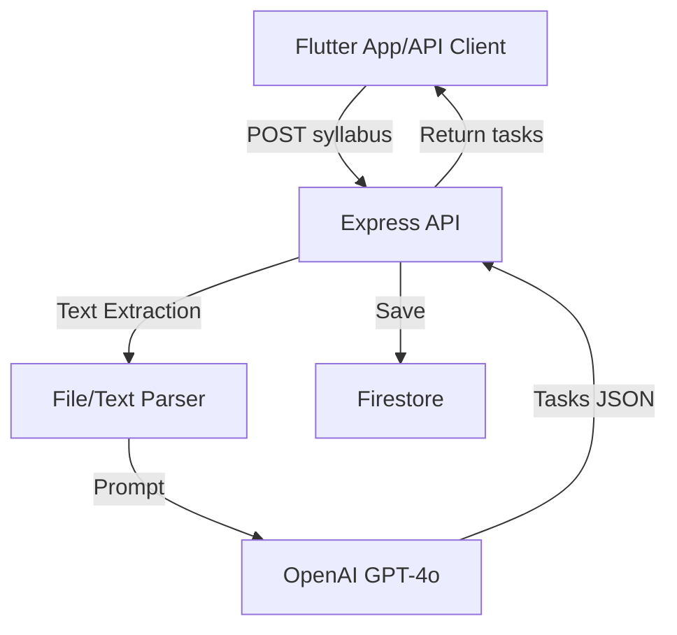
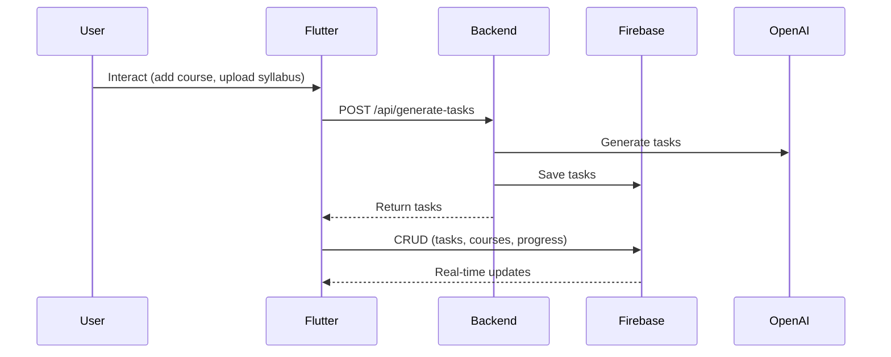

# AI Study Planner

A mobile app that helps students turn their syllabus into actionable study plans using AI. Upload your syllabus, get organized tasks, and track your progress.

## Features

- **Simple Login**: Sign in with Google
- **Course Management**: Add courses and track your progress
- **AI Planning**: Upload Syllabus and let AI create your study schedule
- **Calendar Sync**: Export tasks to Google Calendar
- **Progress Tracking**: See how much you've accomplished

## Getting Started

### What You Need

- Flutter SDK (latest stable)
- Dart SDK
- Android Studio or VS Code with Flutter
- An Android device or emulator

### Installation

1. Clone the repo:
```bash
git clone https://github.com/yeabsira-mesfin/Planner.git
cd Planner/ai_study_planner
```

2. Get dependencies:
```bash
flutter pub get
```

3. Run it:
```bash
flutter run
```

## Project Structure

```
lib/
├── main.dart                # App entry
├── screens/                 # All screens
│   ├── login_screen.dart    # Google sign in
│   ├── home_screen.dart     # Dashboard
│   ├── courses_screen.dart  # Course management
│   ├── planner_screen.dart  # AI task generation
│   └── calendar_screen.dart # Calendar view
├── services/                # Backend stuff
│   └── api_service.dart     # API calls
└── state/                   # App state
    └── auth_state.dart      # Auth management
```


## Frontend Architecture (Flutter)

```mermaid
graph TD
    A[User] -->|Interacts| B[Flutter UI Screens]
    B --> C[State Management]
    C --> D[Services (API, Firebase)]
    D -->|Firestore| E[Firebase]
    D -->|AI Task Gen| F[Backend API]
    F -->|Returns Tasks| D
```

**Layers:**
- UI: `screens/`, `widgets/`
- State: `state/`
- Services: `services/` (API, Firestore)
- Models: Data structures for tasks, courses, user

**Data Flow:**
1. User interacts with UI (add/edit tasks, upload syllabus)
2. State updates and triggers service calls
3. Services interact with Backend API (for AI) or Firebase (for CRUD)
4. UI updates in real time from Firestore

## Backend Architecture (Node.js)



**Components:**
- Express server (`backend/index.js`)
- OpenAI integration for task generation
- File upload & text extraction (PDF/DOCX/TXT)
- Firestore persistence (users/{userId}/courses/{courseId}/tasks/{taskId})

**Flow:**
1. Receives syllabus (text/file) from frontend
2. Extracts text if file
3. Sends prompt to OpenAI, gets structured tasks
4. Saves tasks to Firestore
5. Returns tasks to frontend

## Frontend–Backend–Firebase Data Flow



---

## Tech Used

- **Flutter** - Mobile framework
- **Firebase** - Backend and auth
- **Material 3** - Modern UI
- **OpenAI** - AI task generation

## License

Private project - not for public use